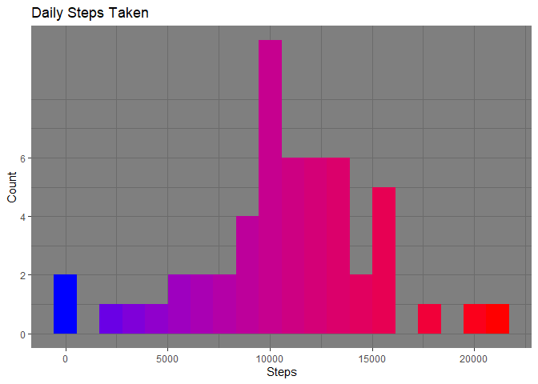
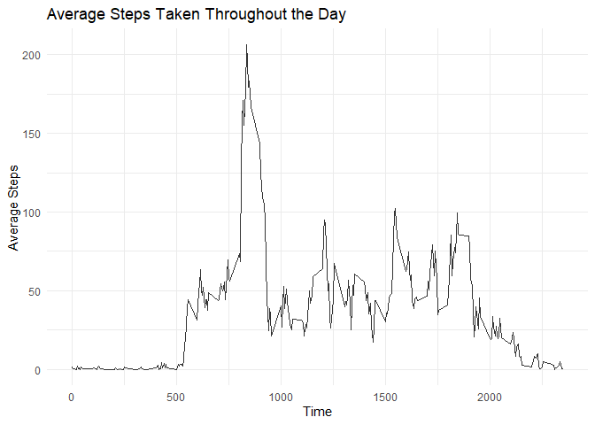
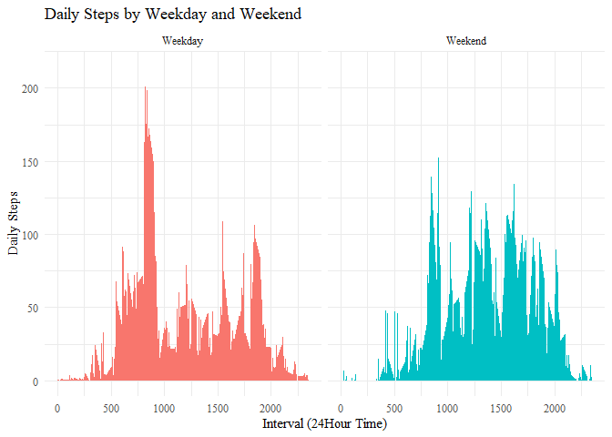

---
output:
  html_document: 
    keep_md: yes
  pdf_document: default
---
Reproducible Research, Course Project 1
==========================================
        

### 1 - Code for reading in the dataset and/or processing the data

The following code loads the required packages, downloads the data from the internet, prints the date downloaded, reads in the data and then modifies the date column into an easier to work with format.


```r
library(dplyr)
library(lubridate)
library(ggplot2)
library(mice)

download.file("https://d396qusza40orc.cloudfront.net/repdata%2Fdata%2Factivity.zip", destfile = "stepsdata")


d <- date()
mydata <- read.csv(unz("stepsdata", "activity.csv"))
mydata$date <- ymd(mydata$date)
```
The date that this data was downloaded was Sat May 09 19:11:11 2020


### 2 - Histogram of the total number of steps taken each day

This code chunk modifies the data into the correct format and then creates a pleasing histogram of daily steps taken 


```r
mydata <- dplyr::group_by(mydata, date)
dailysteps <- summarise(mydata, steps = sum(steps))
mydata <- ungroup(mydata)
dailysteps <- ungroup(dailysteps)

ggplot() + geom_histogram(data = dailysteps, aes(steps, fill = ..x..), bins = 20) +
                theme_dark() +
                scale_y_continuous(breaks = c(0, 2, 4, 6)) +
                labs(title = "Daily Steps Taken", x = "Steps", y = "Count") + 
                scale_fill_gradient(low = "blue", high = "red") + 
                theme(legend.position = "none")
```

<!-- -->


### 3 - Mean and median number of steps taken each day

Next, we calculate the mean and median number of steps taken each day using the data which we manipulated for the histogram


```r
mnsteps <- round(mean(dailysteps$steps, na.rm = TRUE), digits = 7)
mdsteps <- median(dailysteps$steps, na.rm = TRUE)
```
The mean number of steps is 1.0766189\times 10^{4} and the median is 10765


### 4 - Time series plot of the average number of steps taken

Here we create a time series plot of the average number of steps taken within each 5 minute interval, throughout the day. The first code chunk summarises the data by interval and then the second creates a plot


```r
mydata <- group_by(mydata, interval)
mnbyint <- summarise(mydata, avsteps = mean(steps, na.rm = TRUE))
mydata <- ungroup(mydata)
mnbyint <- ungroup(mnbyint)


ggplot(data = mnbyint, aes(interval, avsteps)) + 
        geom_line(col = "grey20", lwd = 0.7) + 
        theme_minimal() + 
        labs(x = "Time", y = "Average Steps", title = "Average Steps Taken Throughout the Day")
```

<!-- -->


### 5 - The 5-minute interval that, on average, contains the maximum number of steps


```r
maxinterval <- subset(mnbyint, avsteps == max(mnbyint[, 2]))
```
The 5-minute interval that, on average, contains the maximum number of steps is 835, 206.1698113 (interval, steps)


### 6 - Code to describe and show a strategy for imputing missing data.
I decided to use predictive mean matching (pmm) to impute the missing variables and used the "mice" package to compute this. Computing these values can take a little bit of time depending upon your computer.

```r
temp <- mice(mydata, m = 5, method = "pmm")
imputed <- complete(temp)
```


### 7 - Histogram of the total number of steps taken each day after missing values are imputed
This sections creates another pleasing histogram in the same style and using the same method as the last.

```r
imputed <- group_by(imputed, date)
impsteps <- summarise(imputed, steps = sum(steps))
imputed <- ungroup(imputed)
impsteps <- ungroup(impsteps)

ggplot() + geom_histogram(data = impsteps, aes(steps, fill = ..x..), bins = 20) +
        theme_dark() +
        scale_y_continuous(breaks = c(0, 2, 4, 6)) +
        labs(title = "Daily Steps Taken of Imputed Data", x = "Steps", y = "Count") + 
        scale_fill_gradient(low = "blue", high = "red") + 
        theme(legend.position = "none")
```

<!-- -->


### 8 - Panel plot comparing the average number of steps taken per 5-minute interval across weekdays and weekends

Finally, to make this panel plot we take the imputed data and (using the weekdays function) calculate which day of the week it was. This value is then factorised, added to the imputed dataframe and used to create a plot

```r
z <- weekdays(imputed$date, TRUE)
z[z %in% c("Mon", "Tue", "Wed", "Thu", "Fri")] <- "Weekday"
z[z %in% c("Sat", "Sun")] <- "Weekend"


imputed$dayofweek <- as.factor(z)

imputed <- group_by(imputed, interval, dayofweek)
weeklyint <- summarise(imputed, avsteps = mean(steps))
imputed <- ungroup(imputed)
weeklyint <- ungroup(weeklyint)


ggplot(weeklyint, aes(x = interval, y = avsteps, group = dayofweek)) +
        geom_area(aes(fill = dayofweek)) + 
        facet_wrap(. ~ dayofweek) + 
        labs(x = "Interval (24Hour Time)", y = "Daily Steps", title = "Daily Steps by Weekday and Weekend") +
        theme_minimal(base_family = "serif") + 
        theme(legend.position = "none")
```

<!-- -->


